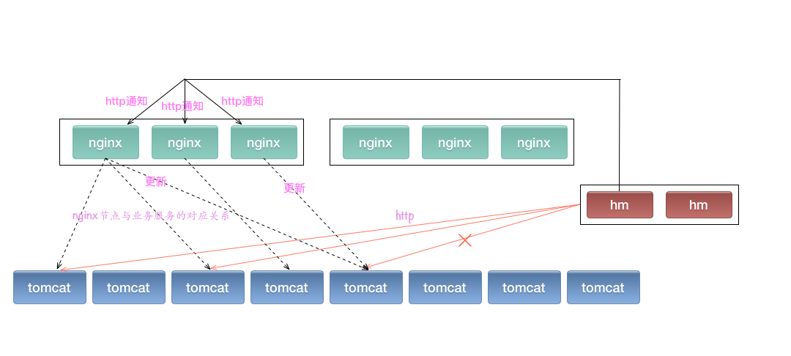
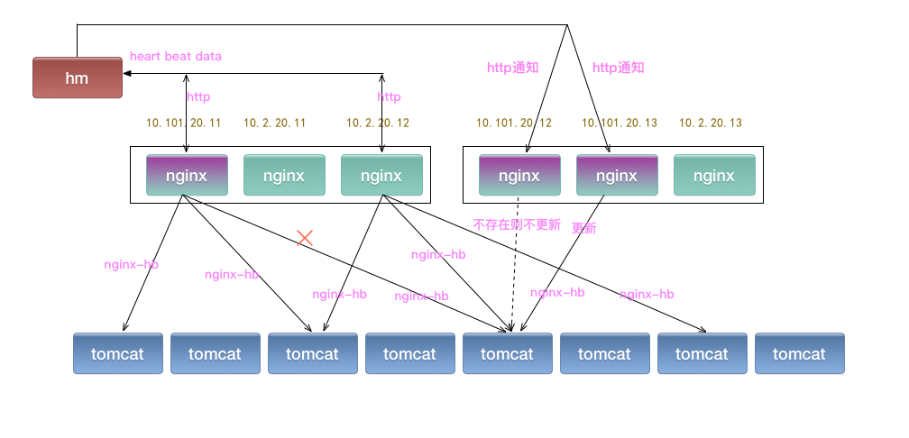

# SLB心跳检测方案

## 方案一：

### 解决方案

新起一个外部服务器，维护所有后台服务的健康状态，并发对所有后台服务器做健康检测。

将检测出状态不一致的服务器节点确认后，通过调用Dyups接口对该应用所属的集群更新upstream-list。

后台服务器数量不断增加，会对做健康监测的服务器造成一定压力，健康检测的延迟、也会越来越大。可以通过水平扩展健康检测节点，为每个节点均分健康检测的范围，提高检测的效率，降低一部分延迟。

    
### 利

可以将健康检测流量降到最低。
    
### 弊

默认所有nginx节点网络互通。

nginx与后台服务器的网络互通状态无法检测，安全性比较低。

一旦一个节点出现问题，需要将设计到的所有nginx节点都要进行更新，更新范围相对较大。

## 方案二：

### 解决方案

每个nginx节点上部署一个agent，按网段划分nginx节点，每个网段挑选一个nginx节点负责检测检测，如果检测出现问题默认同一网段的nginx都认为出现问题，调用Dyups接口更新upstream-list（有则更新，无则不做处理）。

健康检测节点可以根据负载、机器配置选取。

    
### 利

流量大小最坏情况只受网段数量影响。

检测结果对同网段的其他nginx相对更有说服力。
    
### 弊

需要每台nginx都需要部署一个agent，每次新加一台nginx机器都要部署，维护不方便。

如果检测出异常节点是否通知同集群的nginx节点需要作出权衡。

可能会出现检测范围不全面的情况，如果想覆盖所有后台服务器，需要考虑合并同网段所有nginx节点配置或者合理选取健康检测节点保证能够覆盖所有业务服务器。
    

## 方案三：

### 解决方案

站点重复的解决方法：仍然从nginx本身出发，通过更改tengine的健康检测模块逻
辑，过滤重复的ip可以解决站点重复的问题。

多主机的问题解决方法：在第三方检测模块增加参数所在集群的nginx数量，根据数量生成随机序列，制定下一次健康检测的策略，使得多个主机同时进行健康检测的概率降低。

策略举例：例如根据随机序列，在上一次检测成功的基础上，适当延迟下一次检测时间。一旦出现问题，立即返回用户设置的时间间隔进行检测。
    
### 利

不需要额外考虑网络因素以及单独自己开发健康检测逻辑，工作量降低。

依靠nginx自身健康检测，更加安全。

维护简单。
    
### 弊

需要升级nginx，虽然可以平滑升级，但是必须确保开发没问题，对风险作出评估。

不能彻底解决主机重复的问题，只能降低心跳检测的压力。

    
## 方案四：

### 解决方案

站点重复的解决方法同方案三。

可以在第三模仿中增加开关的功能，控制该nginx节点是否需要健康检测，这样可以不用删除所有现有nginx里的健康检测配置，同时可以灵活切换健康检测节点。

依然按网段选取需要做健康检测nginx节点，启动一个agent，不断去轮循获取所有健康检测节点的心跳数据，检测出需要变更的状态通知给同网段其他nginx节点更新upstream-list（有则更新，无则不做处理）。

### 利

只需要一个单独的agent来维护检测状态。
检测结果对同网段的其他nginx相对更有说服力。
    
### 弊

如果检测出异常节点是否通知同集群的nginx节点需要作出权衡。

健康检测的nginx节点的发布以及管理功能要做好。

可能会出现检测范围不全面的情况，如果想覆盖所有后台服务器，需要考虑合并同网段所有nginx节点配置或者合理选取健康检测节点保证能够覆盖所有业务服务器。
    
## 方案五：

### 解决方案

如果健康检测节点按集群划分选取健康检测节点，方案二和方案四都可以引出另外一种方案。检测出的异常节点通知同集群的其他nginx节点。
    
### 利

检测范围全面覆盖，不需要维护配置的一致性。

### 弊

网络的因素会导致一些不安全问题。

## 方案六：

### 解决方案

按网段划分nginx节点，需要申请与网段数相同的nginx服务器（部署在不同网段），这几台机器只做健康检测，不做LB。

合并同一网段的所有nginx配置，去除重复ip，分别写入相应的nginx健康检测节点。

启动一个agent，不断去轮循获取所有健康检测节点的心跳数据，检测出需要变更的状态通知给同网段其他nginx节点更新upstream-list（有则更新，无则不做处理）。

    
### 利

现有集群影响范围很小。

可以全面覆盖检测的范围问题。

流量大小最坏情况只受网段数量影响。

检测结果对同网段的其他nginx相对更有说服力。

### 弊

需要额外申请机器，并且数量受网段数影响。

一旦有集群发布，可能多个健康检测节点需要频繁做出更新。

需要将nginx配置文件合并、管理的工作考虑完善。

## 总结

一旦脱离nginx自己完成健康检测，想把网络因素都解决是相对困难的。每种方法各有利弊，需要去权衡。

- 方案1：最简单，安全性低。
- 方案2、4：同网段检测相对有说服力，但是需要考虑不同网段nginx配置不一致的问题。
- 方案3：完全依赖nginx自身检测，不需要更改任何slb代码，可以完美解决站点重复问题，但是对于多主机问题只能适当降低。主要是要对nginx升级风险作出评估。
- 方案5：实现与方案2相似，可以覆盖所有业务机器，但挑选的健康检测节点并不能代表整个集群。
- 方案6：升级风险最小。网段数约多所需的机器个数就会变多。

